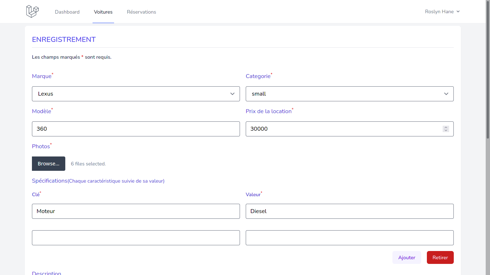
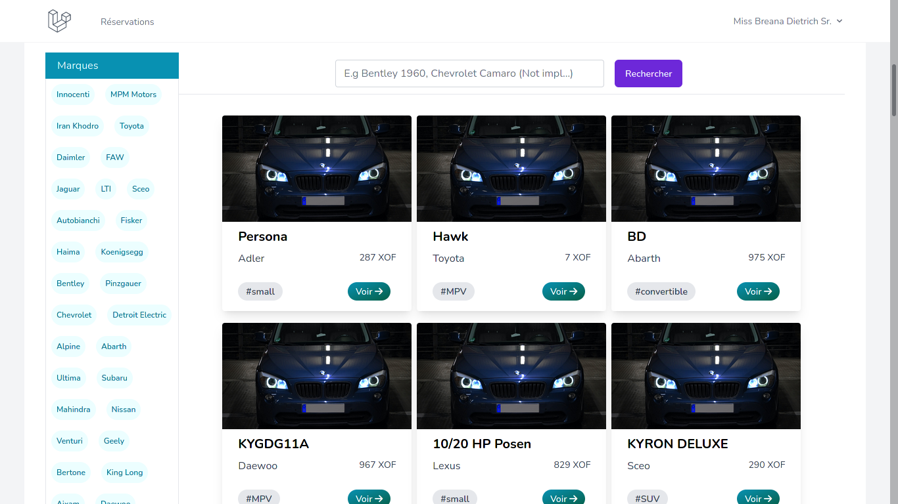

# Bagnolista

## Projet d'application de gestion d'emprunt de véhicules

## Membres:

- AVADEME Harold
- TOGNON Hans

### Requirements

- PHP 8.x
- Composer 2.x
- Node 14.x
- Yarn 1.22.x
-

*Ou avec Laravel sail*

- docker-compose
- Docker

### Setup

```bash
composer install
yarn install
cp .env.example .env
./artisan key:generate
./artisan migrate
./artisan db:seed
yarn watch # Lance mix watch & srtisan serve en mm temps
# Or with Sail
./sail up -d
```

Demo: [http://bagnolista.herokuapp.com](http://bagnolista.herokuapp.com/login)

**Compte Lambda:**

*User:* brenner@example.net

*Password:* password

### Captures des pages developpées

- Accueil
  
  
  

- Login & Inscription
  
  

- Admin Dashboard
  
  
  
- Liste des vehicules (admin)
    
- Liste des reservations (admin)
    
- Ajout de voitures (admin)
    
    

- Page de details d'une voiture
    
    
    

- Mise a jour de voiture
    

- HomePage Utilisateur
    
- Liste des voitures reservees (user lambda)
    
- Formulaire de reservation de voiture
    
- Notification de la reservation
    
